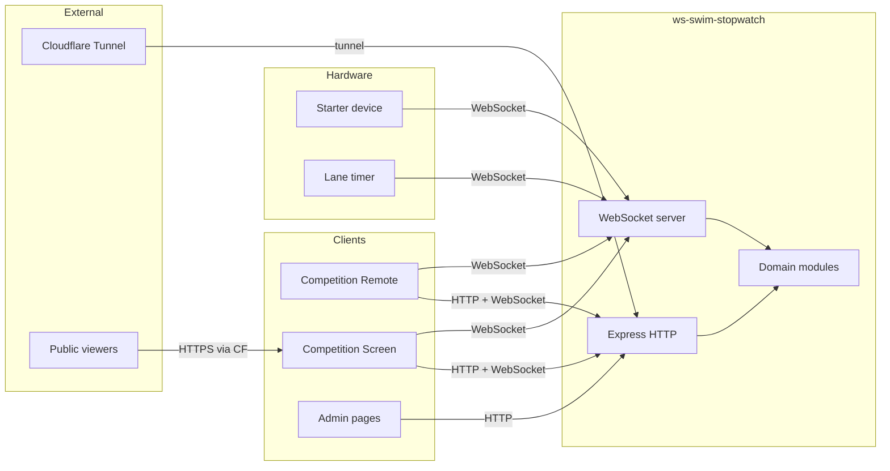
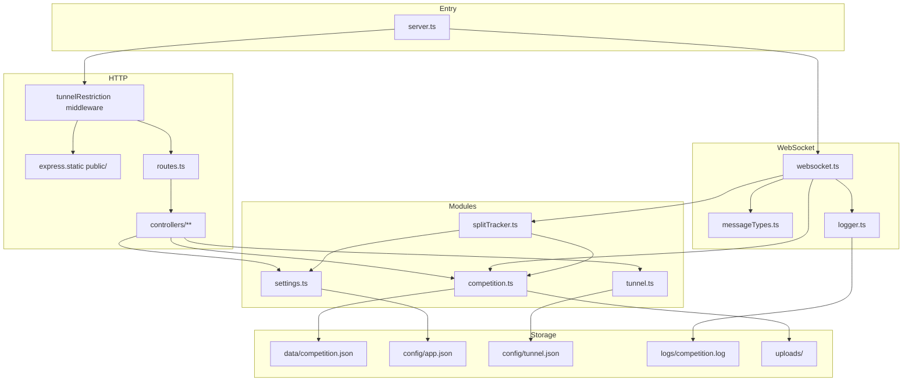
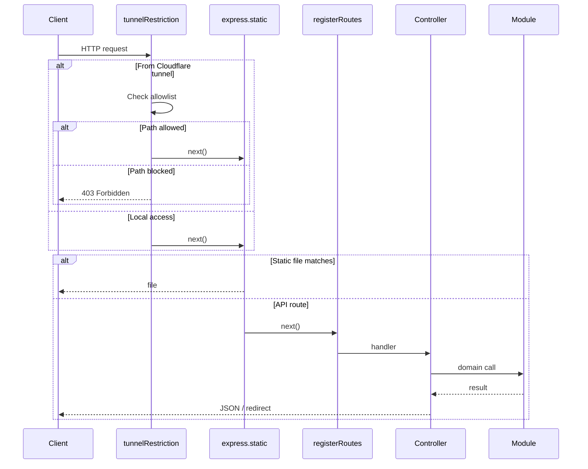
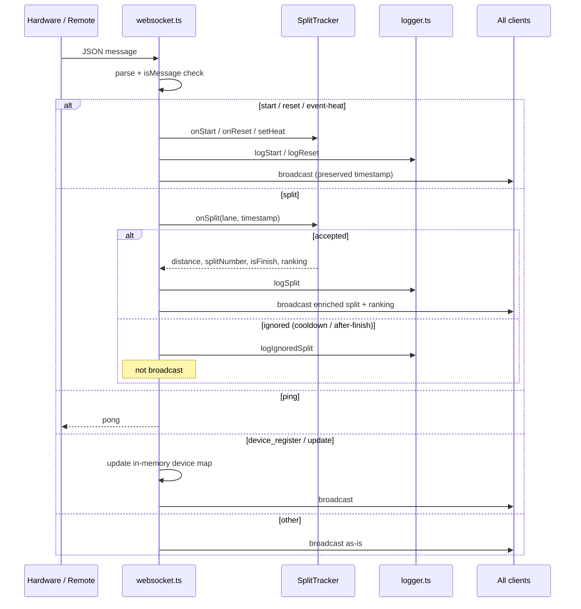
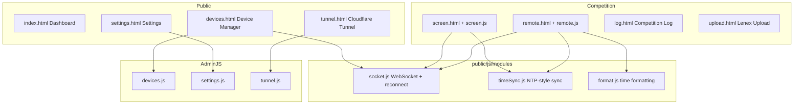
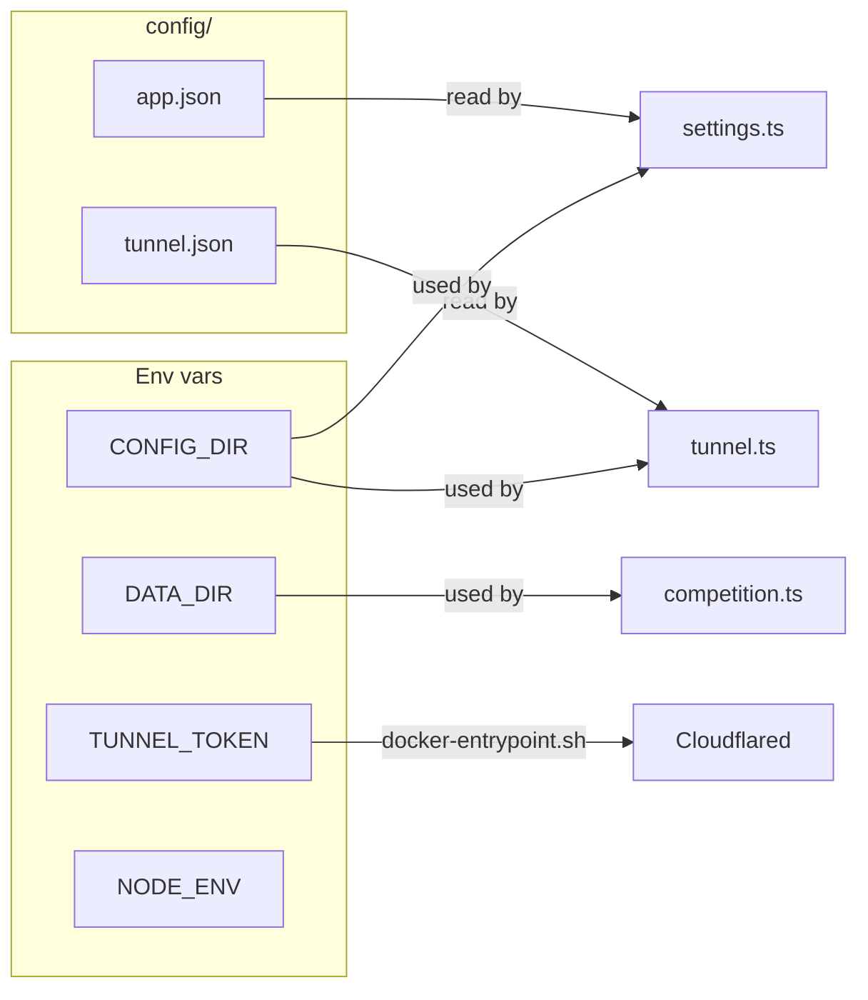

# Architecture Overview

This document describes the high-level architecture of the ws-swim-stopwatch
application: the layers, the request flow, the runtime topology and the
key design rules that keep the codebase maintainable.

## Table of Contents

- [System Context](#system-context)
- [High-Level Architecture](#high-level-architecture)
- [Request Flow](#request-flow)
- [Backend Layers](#backend-layers)
- [Frontend Layers](#frontend-layers)
- [Data Storage](#data-storage)
- [Configuration](#configuration)
- [Design Rules](#design-rules)

## System Context

The server is a single Node.js process that hosts both the HTTP API and the
WebSocket server on the same port (8080). Hardware devices (starter and lane
timers from the [swimwatch-hardware](https://github.com/spelbreker/swimwatch-hardware)
project) connect over WebSocket. Operators use the Remote and Screen pages in
the browser. A Cloudflare Tunnel can expose a restricted subset of pages to
the public internet.

## High-Level Architecture

## Request Flow

### HTTP request lifecycle

The tunnel restriction middleware runs **before** static serving and route
registration. Local requests (no Cloudflare headers) are always allowed.
Tunnelled requests are checked against an allowlist; admin pages, settings,
upload, logs and the remote are blocked by default.

### WebSocket message lifecycle

The server preserves the original client `timestamp` on `start`, `split` and
`reset` messages so that every connected device sees the same race clock.
A `server_timestamp` field is added to every broadcast for debugging.

## Backend Layers

The backend follows a strict three-layer separation:

| Layer | Location | Responsibility |
|-------|----------|----------------|
| **Routes** | `src/routes/routes.ts` | Single `registerRoutes()` function maps URLs to controllers. |
| **Controllers** | `src/controllers/**` | Thin HTTP adapters: parse request, call module, set status, send response. No business logic. |
| **Modules** | `src/modules/**` | Domain logic: competition data, split tracking, settings, tunnel. Pure and unit-testable. |
| **Middleware** | `src/middleware/**` | Cross-cutting concerns (tunnel route restriction). |
| **WebSockets** | `src/websockets/**` | Message contract, server setup, logger. `websocket.ts` is a thin adapter over `SplitTracker`. |

### Module responsibilities

- **`competition.ts`** — Reads and processes Lenex start lists, stores
  `data/competition.json`, and provides queries for sessions, events, heats,
  athletes and relays.
- **`splitTracker.ts`** — Per-heat state machine: cooldown filtering, distance
  labelling, finish detection, arrival ranking. Reads settings live via an
  injected loader.
- **`settings.ts`** — Loads/saves `config/app.json` (pool length, split
  cooldown). Cached in memory with per-field fallback to defaults.
- **`tunnel.ts`** — Spawns and manages the `cloudflared` process, persists
  `config/tunnel.json`, supports auto-start on boot.

## Frontend Layers

The frontend is plain browser JavaScript and static HTML/CSS (Tailwind v4).
There is no build step for the frontend; Tailwind is compiled ahead of time
into `public/css/output.css`.

### Shared browser modules

The frontend uses native ES modules. Shared modules live in `public/js/modules/`:

- `socket.js` — shared `WebSocket` with auto-reconnect; exports `send()`, `onSocketEvent()`.
- `timeSync.js` — `TimeSync` class (NTP-style offset calculation).
- `format.js` — `formatLapTime(ts, base)` and `pad(n)`.

Page entry points import from `../js/modules/*.js` and are loaded with
`<script type="module">`. See [frontend.md](frontend.md) for the full
module structure.

## Data Storage

All persistent state lives outside the source tree so Docker can bind-mount it:

| Path | Env override | Purpose |
|------|--------------|---------|
| `data/competition.json` | `DATA_DIR` | Processed Lenex competition data. |
| `config/app.json` | `CONFIG_DIR` | Application settings (pool length, cooldown). |
| `config/tunnel.json` | `CONFIG_DIR` | Cloudflare tunnel token and flags. |
| `logs/competition.log` | — | Append-only log of starts, resets, splits and ignored splits. |
| `uploads/` | — | Temporary storage for uploaded Lenex files (deleted after processing). |

`config/`, `data/`, `logs/` and `uploads/` are gitignored.

## Configuration

| Variable | Default | Used by |
|----------|---------|---------|
| `DATA_DIR` | `./data` | `competition.ts` (location of `competition.json`) |
| `CONFIG_DIR` | `./config` | `settings.ts`, `tunnel.ts` |
| `TUNNEL_TOKEN` | — | `docker-entrypoint.sh` starts cloudflared on boot if set |
| `NODE_ENV` | — | Express / Docker |

## Design Rules

1. **Controllers stay thin.** Parse request, call a module, map to HTTP status.
   No domain logic in controllers.
2. **Domain logic lives in modules.** Modules are pure, injectable and
   unit-tested without Express or WebSocket dependencies.
3. **Route registration is centralised** in `registerRoutes()`.
4. **`messageTypes.ts` is the WebSocket contract.** Adding or changing a
   message type requires updating both the type union and the client handlers.
5. **Backward compatibility.** Hardware devices keep sending bare
   `{ type, lane, timestamp }` split messages; the server enriches them.
   Older clients can ignore the extra fields.
6. **Tunnel restrictions are always enforced** before static serving and
   routing. Admin pages must remain blocked through Cloudflare by default.
7. **Static pages live under `public/`.** No server-side templating.
8. **Tests mirror source structure** under `test/`.

---

For message-level details see [websocket-api.md](websocket-api.md).
For REST endpoints see [http-api.md](http-api.md).
For the split-aware timing rules see [split-aware-timing.md](split-aware-timing.md).
