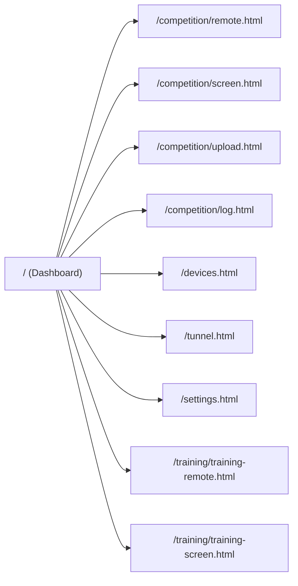

# Frontend Pages

The frontend is plain HTML + browser JavaScript + Tailwind CSS v4. There is
no framework and no client-side build step; Tailwind is compiled ahead of
time into `public/css/output.css` via `npm run build:css`.

All page scripts use native ES modules (`import`/`export`) loaded with
`<script type="module">`. Shared modules live in `public/js/modules/`.

## Table of Contents

- [Page Map](#page-map)
- [Module Structure](#module-structure)
- [Shared Modules](#shared-modules)
- [Competition Remote](#competition-remote)
- [Competition Screen](#competition-screen)
- [Dashboard](#dashboard)
- [Admin Pages](#admin-pages)
- [Training Pages](#training-pages)
- [Layout Convention](#layout-convention)
- [CSS Build](#css-build)

## Page Map



| Page | Path | Purpose | Tunnel access |
|------|------|---------|---------------|
| Dashboard | `/` | Hub with cards linking to all pages | redirected to screen |
| Competition Remote | `/competition/remote.html` | Operator control: start, reset, splits, event/heat selection | blocked |
| Competition Screen | `/competition/screen.html` | Public display: stopwatch, lane times, arrival order | allowed |
| Lenex Upload | `/competition/upload.html` | Upload start list, view loaded competition | blocked |
| Competition Log | `/competition/log.html` | View and download `logs/competition.log` | blocked |
| Device Manager | `/devices.html` | Register, edit and monitor hardware devices | blocked |
| Cloudflare Tunnel | `/tunnel.html` | Start/stop tunnel, configure token and flags | blocked |
| Settings | `/settings.html` | Pool length and split cooldown | blocked |
| Training Remote | `/training/training-remote.html` | Interval training controller | blocked |
| Training Screen | `/training/training-screen.html` | Interval training display | blocked |

## Module Structure

```mermaid
graph BT
    subgraph Shared[public/js/modules]
        Socket[socket.js]
        TimeSync[timeSync.js]
        Format[format.js]
        WakeLock[wakeLock.js]
        Indicator[connectionIndicator.js]
    end

    subgraph Remote[Competition Remote]
        RemoteEntry[competition/remote.js]
        LaneButtons[competition/remote/laneButtons.js]
        EventHeat[competition/remote/eventHeat.js]
        SessionSel[competition/remote/sessionSelector.js]
    end

    subgraph Screen[Competition Screen]
        ScreenEntry[competition/screen.js]
        LaneDisplay[competition/screen/laneDisplay.js]
        Stopwatch[competition/screen/stopwatch.js]
    end

    subgraph Admin[Admin pages]
        Devices[js/devices.js]
        Settings[js/settings.js]
        Tunnel[js/tunnel.js]
        LogViewer[js/logViewer.js]
        Upload[js/upload.js]
    end

    subgraph Training[Training]
        Training[js/training.js]
    end

    RemoteEntry --> Socket
    RemoteEntry --> TimeSync
    RemoteEntry --> Format
    RemoteEntry --> LaneButtons
    RemoteEntry --> EventHeat
    RemoteEntry --> SessionSel

    ScreenEntry --> Socket
    ScreenEntry --> TimeSync
    ScreenEntry --> Format
    ScreenEntry --> LaneDisplay
    ScreenEntry --> Stopwatch
    ScreenEntry --> WakeLock

    Devices --> Socket
    Training --> Socket
```

Each HTML page loads a single entry-point script with
`<script type="module">`. The browser resolves the import graph — no build
step required.

## Shared Modules

All shared modules live in `public/js/modules/` and are imported by page
entry points.

### `public/js/modules/socket.js`

- Exports `send(msg)`, `getSocket()`, and `onSocketEvent(callback)`.
- Creates a single shared `WebSocket` with auto-reconnect (1 s backoff).
- `onSocketEvent` callbacks receive `(event, socket, data)` where `event` is
  `'open'`, `'close'`, or `'message'` and `data` is the parsed JSON message
  (for `'message'` events only).
- Replaces the old `window.socket` global.

### `public/js/modules/timeSync.js`

- Exports the `TimeSync` class.
- NTP-inspired offset calculation: collects up to 8 samples, filters outliers
  by RTT and standard deviation, computes a weighted average offset.
- `getSynchronizedTime()` returns `Date.now() + currentOffset`.
- Used by the remote and screen to keep their stopwatches in sync with the
  server clock.
- Replaces the old `window.TimeSync` global.

### `public/js/modules/format.js`

- Exports `formatLapTime(ts, base)` and `pad(n)`.
- Formats elapsed ms as `mm:ss:cc`.
- Replaces the old `window.formatLapTime` global.

### `public/js/modules/wakeLock.js`

- Exports `requestWakeLock()`.
- Requests a screen wake lock (where supported) to prevent the display from
- sleeping. Re-acquires on visibility change.

### `public/js/modules/connectionIndicator.js`

- Exports `setupConnectionIndicator(onSocketEvent)`.
- Toggles `#connection-indicator` between green (connected) and red
  (disconnected).

## Competition Remote

**Files:** `public/competition/remote.html`, `public/competition/remote.js`,
`public/competition/remote/laneButtons.js`,
`public/competition/remote/eventHeat.js`,
`public/competition/remote/sessionSelector.js`

The remote is the operator's control panel. It sends WebSocket messages and
displays accepted server broadcasts.

Features:

- **Event/heat selection** — fetches `/competition/event` to populate the
  event dropdown; sends `event-heat` messages.
- **Start / Reset** — sends `start` and `reset` with synchronized timestamps.
- **Lane buttons** — clicking a lane button sends a `split` message with the
  current synchronized timestamp. The button does **not** update optimistically;
  it only turns green when the server broadcasts an accepted split back.
- **Green highlight** — the lane button stays green for exactly
  `splitCooldownSec * 1000` ms (fetched from `/settings`). An ignored split
  does not restart the timer.
- **Distance labels** — displays `50m 00:30:12` when the server provides a
  `distance` field.
- **Time sync** — runs the initial rapid ping sequence and ongoing pings.

## Competition Screen

**Files:** `public/competition/screen.html`, `public/competition/screen.js`,
`public/competition/screen/laneDisplay.js`,
`public/competition/screen/stopwatch.js`

The screen is the public display shown on a TV or projector. It only
receives data — it has no controls.

Features:

- **Stopwatch** — runs locally using `startTime` (from the `start` message)
  and the server time offset.
- **Lane information** — fetches `/competition/event/:event/heat/:heat` on
  event/heat change to show athlete names and clubs per lane.
- **Split times** — on each accepted split, renders the distance label and
  formatted time in the lane's split cell.
- **Arrival order** — redraws all placement cells from the server-provided
  `ranking` array on every split.
- **Finish marker** — adds a persistent `.finished` CSS class when
  `isFinish` is true.
- **Highlight** — briefly highlights a lane (2 s) when a split arrives.
- **Clear** — clears all lane info, split times, arrival orders and finish
  markers on `clear`, `start`, `reset` and `event-heat`.

## Dashboard

**File:** `public/index.html`

A card-based landing page linking to every other page. Each card has an icon,
title and short description. The dashboard is the local home page; via the
Cloudflare tunnel it is redirected to `/competition/screen.html`.

## Admin Pages

All admin pages share a common layout (see [Layout Convention](#layout-convention)).

### Device Manager (`/devices.html`)

- Lists all registered hardware devices with role, lane, IP, connection
  status and last-seen time.
- Supports editing device role and lane via a modal.
- Communicates over WebSocket for real-time updates and calls `GET /devices`
  for the initial list.
- Script: `public/js/devices.js`.

### Cloudflare Tunnel (`/tunnel.html`)

- Shows tunnel status (running, PID, URL, connection info, errors).
- Start/stop the tunnel, configure the token, toggle auto-start and
  allow-all-routes.
- Script: `public/js/tunnel.js`; calls `/tunnel/*` REST endpoints.

### Settings (`/settings.html`)

- Radio buttons for pool length (25 m / 50 m).
- Number input for split cooldown (1–60 s).
- Saves via `POST /settings`.
- Script: `public/js/settings.js`.

### Competition Log (`/competition/log.html`)

- Displays `logs/competition.log` in a `<pre>` block.
- Auto-refreshes every 10 seconds.
- "Refresh Log" and "Download Log" buttons.
- Download triggers `GET /logs/competition.log?download=1`.
- Script: `public/js/logViewer.js`.

### Lenex Upload (`/competition/upload.html`)

- File upload form (`POST /competition/upload`).
- Shows the currently loaded competition summary (meet name, sessions,
  events, clubs).
- Delete button to remove the loaded competition.
- Instructions for exporting from SplashMe.
- Script: `public/js/upload.js`.

## Training Pages

**Files:** `public/training/training-remote.html`,
`public/training/training-screen.html`, `public/js/training.js`

A separate interval-training mode. The remote creates/deletes/starts
intervals; the screen displays the active interval timer. Uses the same
WebSocket connection but with `add-interval`, `start-interval` and
`delete-interval` message types (see `TrainingMessage` in
`src/websockets/messageTypes.ts`).

## Layout Convention

All admin pages (devices, tunnel, settings, log, upload) follow the same
structure, modelled after the device manager:

```html
<div class="relative flex min-h-screen flex-col overflow-hidden py-6 sm:py-12">
  <div class="mx-auto w-full max-w-{3xl|5xl|7xl} px-4 sm:px-6 lg:px-8">
    <header class="mb-8">
      <div class="flex items-center justify-between">
        <!-- icon + h1 page title -->
        <!-- "Back to Dashboard" button -->
      </div>
      <p class="mt-2 text-gray-600 dark:text-gray-400"><!-- short description --></p>
    </header>
    <!-- main content cards -->
    <footer class="..."><!-- copyright --></footer>
  </div>
</div>
```

Width varies by content:

| Page | Max width |
|------|-----------|
| Device Manager, Competition Log | `max-w-7xl` |
| Lenex Upload | `max-w-5xl` |
| Cloudflare Tunnel, Settings | `max-w-3xl` |

## CSS Build

Tailwind v4 is compiled via the CLI:

```sh
npm run build:css     # one-shot
npm run watch:css     # watch mode
```

Input: `public/css/base.css` → Output: `public/css/output.css`

The compiled CSS is committed to the repository so deployments do not need
the Tailwind CLI. Rebuild after adding new utility classes.
