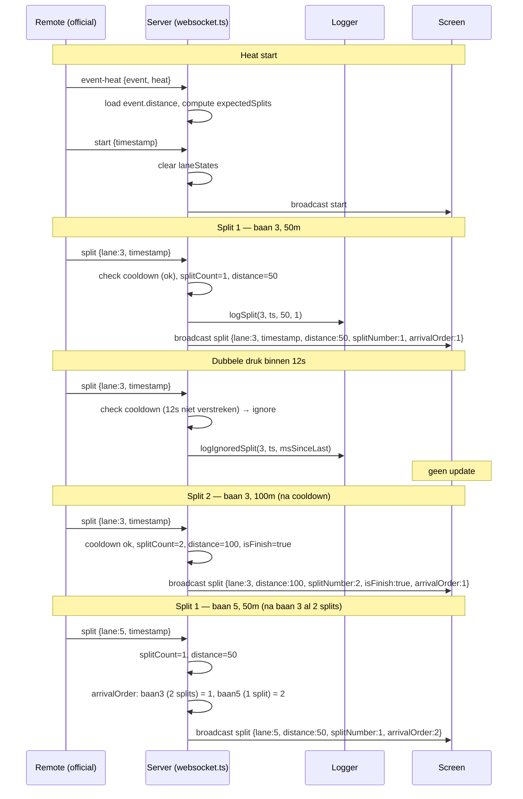

# Split-aware timing: lane distance, cooldown, arrival order

## Feature Description

Systeem bewust maken van badlengte en aantal te klokken banen. Per baan tussentijden labelen (50m, 100m, 150m...). Plaatsing op scherm gebaseerd op aantal voltooide splits, dan op laatste split-tijd. Ongewenste dubbele/per ongeluk splits negeren via per-baan cooldown (default 12s, instelbaar). Genegeerde tijden loggen.

## Repos to be changed

Enkel repo: `ws-swim-stopwatch`. Geen externe repos. `swimwatch-hardware` stuurt alleen `split` met `lane` + `timestamp` — protocol-uitbreiding is backward-compatible (server verrijkt, hardware hoeft niets te veranderen).

## Breaking changes and risks

| Wijziging | Breaking | Risico | Mitigatie |
|-----------|----------|--------|-----------|
| `split` broadcast uitbreiden met `distance`/`splitNumber`/`isFinish`/`arrivalOrder` | Nee — extra velden, oude clients negeren | Laag | Backward-compat velden |
| Per-lane state in `websocket.ts` (splitCount, lastSplitWallTime) | Nee — intern | Laag | Reset bij start/reset/event-heat |
| Nieuwe `config.json` module | Nee — nieuw | Laag | Default fallbacks (25m, 12s) |
| Nieuwe routes `GET/POST /config` | Nee — nieuw | Laag | Tunnel-restriction: blok `/config` voor CF |
| Arrival-order logica verhuist client→server | Ja — screen.js arrival-logica weg | Medium | Smoke test plaatsing |
| `event-heat` moet event.distance laden voor expected-splits | Nee — server haalt op | Laag | Fallback: geen competition.json → geen labels, raw splits |

## Migration steps per repo

### Backend (`src/`)

1. **Nieuw module `src/modules/config.ts`**:
   ```ts
   interface AppConfig {
     poolLength: number;        // 25 of 50, default 25
     splitCooldownSec: number;  // default 12
   }
   // loadConfig(): AppConfig — fallback defaults
   // saveConfig(cfg): boolean
   // pad: ./config/app.json
   ```
   Bestaande `tunnel.ts` loadConfig/saveConfig blijven ongemoeid (aparte file `tunnel.json`).

2. **Nieuw controller `src/controllers/configController.ts`**:
   - `getConfig` → `res.json(loadConfig())`
   - `postConfig` → valideer `poolLength` (25|50), `splitCooldownSec` (1..60), saveConfig, `res.json({success:true})`

3. **Routes** in `src/routes/routes.ts`:
   ```ts
   app.get('/config', getConfig);
   app.post('/config', json(), postConfig);
   ```

4. **Tunnel-restriction** `src/middleware/tunnelRestriction.ts`: voeg `/config` toe aan geblokkeerde routes (admin-only, niet via CF).

5. **WebSocket `src/websockets/websocket.ts`** — kernwijziging:
   - Per-lane state Map: `Map<number, { splitCount: number; lastSplitWallMs: number; lastSplitTimestamp: number }>`
   - Per-heat expected-splits: `Map<string, number>` (key = `${event}:${heat}`, value = `event.distance / poolLength`)
   - Op `event-heat` message: laad event via `Competition.getEvent()`, bereken expectedSplits, store in map. Clear per-lane state.
   - Op `start`: clear per-lane state (nieuwe race).
   - Op `reset`: clear per-lane state + expected-splits map.
   - Op `split`:
     ```ts
     const cooldownSec = loadConfig().splitCooldownSec;
     const laneState = laneStates.get(lane);
     if (laneState && (Date.now() - laneState.lastSplitWallMs) < cooldownSec * 1000) {
       logIgnoredSplit(lane, timestamp, Date.now() - laneState.lastSplitWallMs);
       return; // niet broadcasten
     }
     const splitCount = (laneState?.splitCount ?? 0) + 1;
     const poolLength = loadConfig().poolLength;
     const distance = splitCount * poolLength;
     const expected = expectedSplits.get(`${event}:${heat}`) ?? 0;
     const isFinish = splitCount >= expected || expected === 0;
     laneStates.set(lane, { splitCount, lastSplitWallMs: Date.now(), lastSplitTimestamp: timestamp });
     // Bereken arrival order: sorteer lanes op (splitCount desc, lastSplitTimestamp asc)
     const arrivalOrder = computeArrivalOrder(laneStates);
     const enriched = { ...msg, distance, splitNumber: splitCount, isFinish, arrivalOrder: arrivalOrder[lane] };
     logSplit(lane, timestamp, undefined, distance, splitNumber);
     broadcastAllClients(wss, enriched);
     ```
   - `computeArrivalOrder(laneStates)`: retourneer `Map<lane, place>` — sorteer alle lanes met splitCount>0 op `(splitCount desc, lastSplitTimestamp asc)`, wijs plaats 1..N toe.

6. **Logger `src/websockets/logger.ts`**:
   - `logSplit` uitbreiden met optionele `distance` + `splitNumber` params.
   - Nieuw `logIgnoredSplit(lane, timestamp, msSinceLast)` → schrijf naar `logs/ignored-splits.log` met timestamp, lane, genegeerde tijd, ms sinds laatste split.

7. **Message types `src/websockets/messageTypes.ts`**:
   - `split` uitbreiden: `distance?: number; splitNumber?: number; isFinish?: boolean; arrivalOrder?: number`
   - Geen nieuw message-type nodig (verrijking van bestaande `split`).

### Frontend (`public/`)

8. **`public/competition/screen.js`**:
   - Split-handler: gebruik `message.distance` voor label (`${message.distance}m`), `message.arrivalOrder` voor plaats-cell. Verwijder lokale `arrivalOrder` counter + 20s clear-timer (server bepaalt nu).
   - `updateLaneDisplay`: toon split-label naast tijd, bijv. `50m  00:28.45`.
   - Bij `isFinish`: marker baan als finished (visueel, bv. groene highlight blijvend).

9. **`public/competition/remote.js`**:
   - Geen wijziging in split-send (stuurt nog steeds `{type:'split', lane, timestamp}`). Server verrijkt.
   - Optioneel: toon cooldown-status per baan (visueel, bv. knop grijs gedurende cooldown). Hiervoor moet server cooldown-status broadcasten — optioneel, aparte taak indien gewenst.

10. **Nieuwe settings-pagina `public/settings.html` + `public/js/settings.js`**:
    - Form: badlengte (25/50 radio), cooldown-sec (number input 1..60).
    - `GET /config` laden, `POST /config` opslaan.
    - Link vanaf `index.html` dashboard.

11. **Dashboard `public/index.html`**: voeg kaart/link toe naar `settings.html`.

### Tests (`test/`)

12. **`test/modules/config.test.ts`**: loadConfig default fallbacks, saveConfig + reload, invalid input.

13. **`test/controllers/configController.test.ts`**: GET retourneert defaults, POST valideert poolLength (25|50), POST weigert cooldownSec <1 of >60.

14. **`test/websockets/split-cooldown.test.ts`** (nieuw): 
    - Eerste split geaccepteerd, tweede binnen cooldown genegeerd, derde na cooldown geaccepteerd.
    - Per-lane onafhankelijk (baan 3 cooldown blokkeert niet baan 4).
    - Arrival-order: baan met meer splits staat hoger; bij gelijk count wint snelste tijd.
    - Reset/start/event-heat clear state.
    - `logIgnoredSplit` aangeroepen bij genegeerde split (spyOn).

15. **`test/middleware/tunnelRestriction.test.ts`**: `/config` geblokkeerd via CF.

### Docs

16. **`docs/websocket-api.md`**: `split` payload uitbreiden met `distance`, `splitNumber`, `isFinish`, `arrivalOrder`. Nieuwe sectie "Split cooldown & ignored splits". State-diagram update: Running-state nu per-lane cooldown-substate.

17. **`README.md`**: settings-pagina vermelding.

## Edge cases

- **Official vergeet split(s)**: laatste ontvangen split = finish. Label toont werkelijke afstand (`splitCount * poolLength`), niet event.distance. Voor 100m free met 1 split op 25m-bad: label `25m`, aankomst-order gebaseerd op 1 split. Eerlijk wat binnenkwam.
- **Official drukt alleen eindtijd**: 1 split, label = `25m` (op 25m bad) of `50m` (op 50m bad). Arrival-order = 1 voor die baan. Geen 100m-label omdat server niet weet of het finish was zonder expected-splits. Acceptabel — tijd klopt, label is werkelijke afstand.
- **Dubbele druk binnen cooldown**: genegeerd, gelogd in `logs/ignored-splits.log`. Geen broadcast, scherm ongewijzigd.
- **Geen competition.json geladen**: expectedSplits = 0, `isFinish` = false altijd, labels = `splitCount * poolLength` (werkt nog, alleen geen finish-markering). Systeem bruikbaar zonder upload.
- **Event-heat change mid-race**: state clear, nieuwe heat start schoon. Voorkomt mix van splits tussen heats.
- **Pool-length wijziging mid-heat**: geldt pas voor volgende heat (state clear op event-heat). Wijziging tijdens race = onvoorspelbaar, niet aanbevolen. UI waarschuwt optioneel.

## Diagram



## Config schema

`config/app.json`:
```json
{
  "poolLength": 25,
  "splitCooldownSec": 12
}
```

Defaults bij ontbreken file: `poolLength=25`, `splitCooldownSec=12`.

## Volgorde

1. `src/modules/config.ts` + tests
2. `src/controllers/configController.ts` + routes + tunnel-restriction update + tests
3. `src/websockets/logger.ts` uitbreiden (logSplit distance/splitNumber, logIgnoredSplit)
4. `src/websockets/websocket.ts` per-lane state, cooldown, distance-calc, arrival-order, reset/start/event-heat clear + tests
5. `src/websockets/messageTypes.ts` split-uitbreiding
6. `public/competition/screen.js` label + arrival-order van server
7. `public/settings.html` + `public/js/settings.js`
8. `public/index.html` settings-link
9. Docs update
