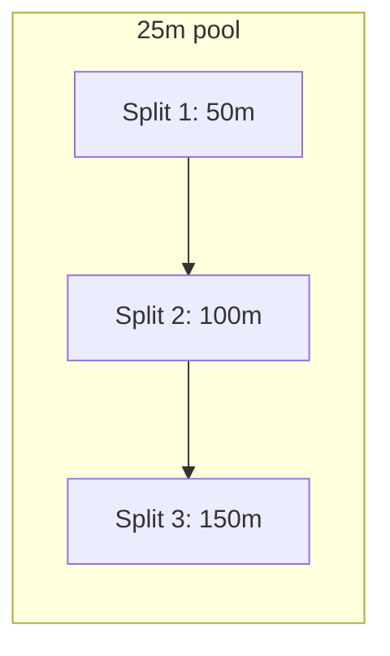
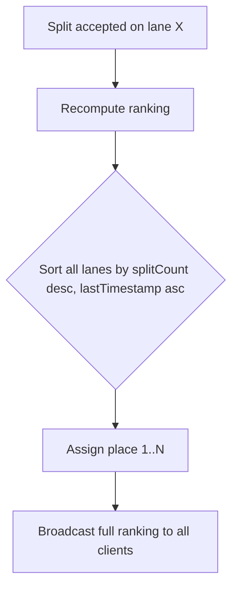
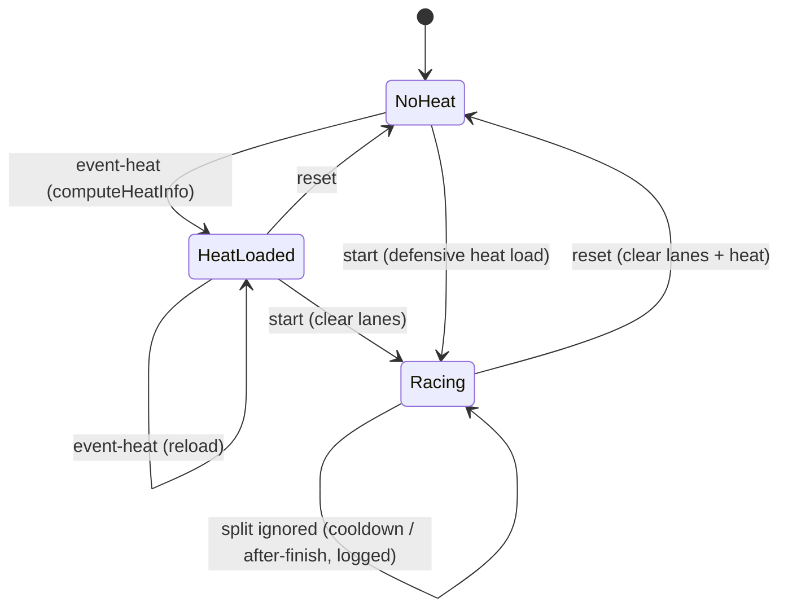

# Split-Aware Timing

This document describes the split-aware timing system implemented in
`src/modules/splitTracker.ts` and wired into the WebSocket adapter
(`src/websockets/websocket.ts`). The system labels each split with the
distance covered, filters accidental double presses via a per-lane cooldown,
detects finishes, computes arrival ranking, and logs ignored splits.

## Table of Contents

- [Concepts](#concepts)
- [Configuration](#configuration)
- [Split Distance Calculation](#split-distance-calculation)
- [Cooldown Filtering](#cooldown-filtering)
- [Finish Detection](#finish-detection)
- [Arrival Ranking](#arrival-ranking)
- [State Lifecycle](#state-lifecycle)
- [Logging](#logging)
- [WebSocket Enrichment](#websocket-enrichment)
- [Frontend Behaviour](#frontend-behaviour)

## Concepts

The official timekeeper stands at one end of the pool and clocks each lane
every **two lengths**. This means a split covers `2 * poolLength` meters:

- 25 m pool → splits at 50 m, 100 m, 150 m, ...
- 50 m pool → splits at 100 m, 200 m, 300 m, ...



## Configuration

Settings are stored in `config/app.json` and managed via `GET/POST /settings`
(see [http-api.md](http-api.md#settings)).

| Setting | Type | Default | Validation |
|---------|------|---------|------------|
| `poolLength` | `25` \| `50` | `25` | must be exactly 25 or 50 |
| `splitCooldownSec` | integer | `12` | 1–60 inclusive |

The `SplitTracker` receives a `getSettings` loader function so it always reads
the current settings live — no restart needed after a settings change.

## Split Distance Calculation

```
splitDistance = poolLength * 2
totalDistance = swimstyle.distance * max(1, swimstyle.relaycount)
expectedSplits = ceil(totalDistance / splitDistance)   (when totalDistance > 0)
distance = min(splitNumber * splitDistance, totalDistance)   (when totalDistance > 0)
          = splitNumber * splitDistance                     (otherwise)
```

Examples (25 m pool, `splitDistance = 50`):

| Event | Total distance | Expected splits | Labels |
|-------|---------------|-----------------|--------|
| 50 m free | 50 | 1 | 50m (finish) |
| 100 m free | 100 | 2 | 50m, 100m (finish) |
| 200 m free | 200 | 4 | 50m, 100m, 150m, 200m (finish) |
| 4 x 50 m relay | 200 | 4 | 50m, 100m, 150m, 200m (finish) |

**Odd-distance events:** when `totalDistance` is not a multiple of
`splitDistance`, the last label is capped at `totalDistance`. For example a
25 m event in a 25 m pool produces a single `25m` split (finish).

**No competition data:** if no `competition.json` is loaded (or the event is
not found), `totalDistance` and `expectedSplits` are `0`. Distance labels
still increment (`50m`, `100m`, ...) but `isFinish` is never set and finishes
are not detected.

## Cooldown Filtering

Each lane has an independent cooldown window. When a split arrives on a lane
that already has an accepted split:

```
msSinceLast = msg.timestamp - lane.lastTimestamp
if msSinceLast < splitCooldownSec * 1000:
    → ignored (reason: "cooldown")
```

Key properties:

- The cooldown compares the **synchronized client `timestamp`**, not server
  `Date.now()`. This keeps cooldown deterministic across devices.
- An ignored split does **not** advance the cooldown window — the next split
  is still compared against the last *accepted* split's timestamp.
- The first split on a lane is always accepted (no previous timestamp).
- Cooldown is per-lane; one lane's cooldown does not affect another.

## Finish Detection

When `expectedSplits > 0` and `splitNumber >= expectedSplits`, the split is
marked as the finish (`isFinish: true`) and the lane's `finished` flag is
set. Any further splits on a finished lane are ignored:

```
if lane.finished:
    → ignored (reason: "after-finish")
```

Post-finish splits are logged but not broadcast.

## Arrival Ranking

The ranking is computed server-side on every accepted split and broadcast in
full so that all clients can redraw every placement cell.

Sort key:

1. **More completed splits first** (`splitCount` descending)
2. **Earlier last split timestamp second** (`lastTimestamp` ascending)

Only lanes with at least one accepted split appear in the ranking.

```json
[
  { "lane": 3, "place": 1, "splitNumber": 2 },
  { "lane": 5, "place": 2, "splitNumber": 1 }
]
```



## State Lifecycle

The `SplitTracker` holds per-lane state (`splitCount`, `lastTimestamp`,
`finished`) and the current heat info (`event`, `heat`, `totalDistance`,
`expectedSplits`).



| Event | Lane state | Heat state |
|-------|-----------|------------|
| `event-heat` | cleared | reloaded from `competition.json` |
| `start` | cleared | preserved (reloaded if event/heat differ from current) |
| `reset` | cleared | cleared |
| `clear` | unchanged | unchanged (UI-only) |

The WebSocket adapter also defensively reloads heat info on `start` if the
message carries a different `event`/`heat` than the tracker's current heat,
covering the case where a starter sends `start` without a preceding
`event-heat`.

## Logging

All timing events are appended to `logs/competition.log`:

| Event | Log prefix | Example |
|-------|-----------|---------|
| Start | `START` | `[ISO] START - Event: 1, Heat: 2, Timestamp: ...` |
| Reset | `RESET` | `[ISO] RESET - Timestamp: ...` |
| Accepted split | `SPLIT` | `[ISO] SPLIT - Lane: 3, Time: 00:30.123, Distance: 50m, Split: 1` |
| Ignored split | `SPLIT IGNORED` | `[ISO] SPLIT IGNORED - Lane: 3, Reason: cooldown, Since last: 500ms` |

The race time in logs is computed as `timestamp - lastStartTimestamp`, floored
to whole milliseconds to avoid fractional output from time-synced timestamps.
Raw timestamps are preserved.

The log can be viewed at `/competition/log.html` or downloaded via
`GET /logs/competition.log?download=1`.

## WebSocket Enrichment

Hardware devices keep sending the bare split message:

```json
{ "type": "split", "lane": 3, "timestamp": 1718000030000 }
```

The server runs the split through `SplitTracker.onSplit()` and, if accepted,
broadcasts the enriched message to all clients:

```json
{
  "type": "split",
  "lane": 3,
  "timestamp": 1718000030000,
  "distance": 50,
  "splitNumber": 1,
  "isFinish": false,
  "ranking": [
    { "lane": 3, "place": 1, "splitNumber": 1 }
  ],
  "server_timestamp": 1718000030003
}
```

Ignored splits are **not broadcast**; they are only logged. This prevents the
screen and remote from showing splits that the server rejected.

See [websocket-api.md](websocket-api.md#split--lap) for the full message
contract.

## Frontend Behaviour

### Screen (`public/competition/screen.js`)

- On every accepted split, redraws **all** arrival-order cells from the
  server-provided `ranking` array (not just the changed lane).
- Displays the distance label and formatted time, e.g. `50m 00:30:12`.
- Adds a persistent `.finished` CSS class when `isFinish` is true.
- Clears split times, arrival orders and finish markers on `start`, `reset`,
  `event-heat` and `clear`.

### Remote (`public/competition/remote.js`)

- Does **not** optimistically update lane times on button click; it only
  displays what the server broadcasts.
- Fetches `/settings` on page load and on each `start` to get the current
  `splitCooldownSec`.
- The lane button stays green for exactly `splitCooldownSec * 1000` ms after
  an accepted split. An ignored split does not restart the green timer.
- Cancels all highlight timers on `clear`, `reset` and heat changes.
