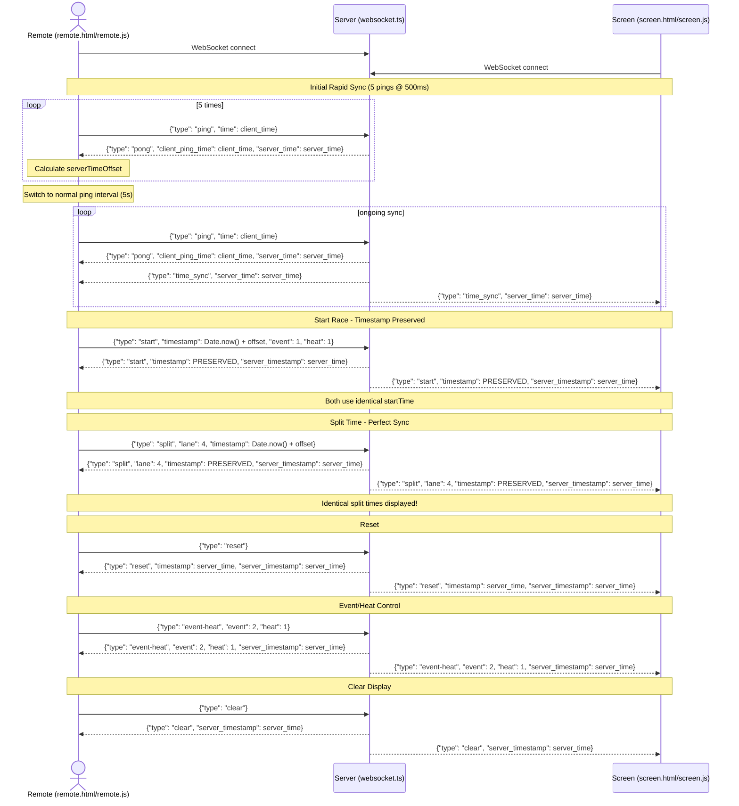

# WebSocket Time Sync & Control Flow Explanation

## 1. Connection Setup
Both the Remote (controller) and Screen (display) clients establish a WebSocket connection to the Server. This allows for real-time, bidirectional communication.

## 2. Time Synchronization Process

### Initial Rapid Synchronization
- Upon connection, clients perform **5 rapid pings at 500ms intervals** for quick initial sync
- After initial sync, switches to **normal ping interval of 5 seconds**
- Server also broadcasts `time_sync` messages every 5 seconds to all clients

### Time Offset Calculation
Clients calculate their server time offset using:
```javascript
serverTimeOffset = (server_time - client_ping_time - roundTripTime/2)
```

### Synchronized Timestamp Generation
All timing operations use synchronized timestamps:
```javascript
synchronizedTime = Date.now() + serverTimeOffset
```

## 3. Stopwatch Control (Updated Implementation)

### Start
- **Remote sends:** `start` message with **client-synchronized timestamp** (`Date.now() + serverTimeOffset`)
- **Server preserves:** Original client timestamp (no overwriting with server time)
- **Server broadcasts:** Same timestamp to all clients, ensuring universal start time
- **All clients use:** Identical start timestamp for calculations

### Split (Lap) 
- **Remote sends:** `split` message with **client-synchronized timestamp** and lane number
- **Server preserves:** Original client timestamp (maintaining sub-millisecond precision)
- **Server broadcasts:** Same timestamp to all clients
- **Result:** All devices show identical split times

### Reset
- **Remote sends:** `reset` message
- **Server generates:** Reset timestamp using server time
- **Server broadcasts:** Reset with server timestamp to all clients

## 4. Critical Implementation Details

### Timestamp Preservation
**Key Fix:** Server preserves original client timestamps instead of overwriting them. This ensures:
- Perfect time synchronization across all devices
- Sub-millisecond precision maintained
- Identical split time calculations on all clients

### Universal Time Base
- **Start time:** All devices receive and use the same start timestamp
- **Split times:** All devices receive and use the same split timestamps  
- **Calculations:** `splitTime - startTime` yields identical results everywhere

## 5. Event/Heat and Screen Control
- **Event/Heat Change:** Server broadcasts to sync event/heat display across all clients
- **Clear Screen:** Server broadcasts to clear lane and split displays on all clients

## 6. Broadcast Pattern
The Server acts as a **message relay and timestamp coordinator**:
- Receives messages from any client
- **Preserves timing-critical timestamps** (start, split)
- **Adds server_timestamp** for debugging/logging
- Broadcasts to all connected clients (including sender)

## 7. Time Synchronization Flow Diagram



## 8. Message Examples

### Time Sync Messages
```json
// Ping
{"type": "ping", "time": 1751100443179}

// Pong Response
{"type": "pong", "client_ping_time": 1751100443179, "server_time": 1751100443317}

// Periodic Sync
{"type": "time_sync", "server_time": 1751100444403}
```

### Timing Messages
```json
// Start (Outgoing)
{"type": "start", "timestamp": 1751100440326.9302, "heat": "1", "event": "1"}

// Start (Server Broadcast)
{"type": "start", "timestamp": 1751100440326.9302, "heat": "1", "event": "1", "server_timestamp": 1751100440330}

// Split (Outgoing)  
{"type": "split", "lane": "4", "timestamp": 1751100443738.7864}

// Split (Server Broadcast)
{"type": "split", "lane": "4", "timestamp": 1751100443738.7864, "server_timestamp": 1751100443741}
```

## 9. Key Benefits

✅ **Perfect Synchronization:** All devices show identical times  
✅ **Sub-millisecond Precision:** Decimal timestamps maintained  
✅ **Network Latency Compensation:** Server offset calculation accounts for delays  
✅ **Universal Time Base:** Single source of truth for all timing calculations  
✅ **Scalable Architecture:** Any number of devices can connect and stay synchronized  

This architecture ensures that whether you're using the remote controller or viewing the screen display, all timing information is perfectly synchronized across the entire swimming competition system.
