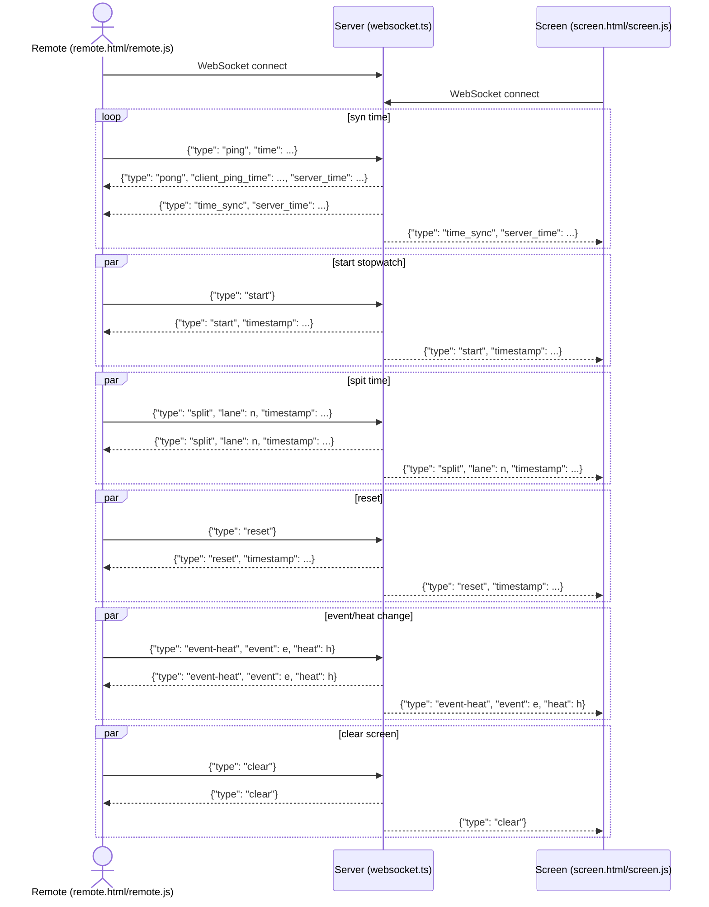

# WebSocket Time Sync & Control Flow Explanation
1. Connection Setup
Both the Remote (controller) and Screen (display) clients establish a WebSocket connection to the Server. This allows for real-time, bidirectional communication.

2. Time Synchronization
The Remote client regularly sends a ping message to the Server, including the current client time.
The Server responds with a pong message, echoing the client’s ping time and including the current server time.
The Server also periodically broadcasts a time_sync message with the current server time to all connected clients (Remote and Screen).
Both clients use these messages to calculate and adjust for any time offset between their local clocks and the server’s clock, ensuring accurate and synchronized timing for all stopwatch operations.
3. Stopwatch Control
Start: When the Remote sends a start message, the Server broadcasts a start message (with a server-generated timestamp) to all clients. Both Remote and Screen use this timestamp to start their stopwatches in sync.
Split (Lap): When the Remote sends a split message (with lane and timestamp), the Server broadcasts this to all clients. Both Remote and Screen update the split time display for the specified lane.
Reset: When the Remote sends a reset message, the Server broadcasts a reset message (with a server timestamp) to all clients, resetting the stopwatch everywhere.
4. Event/Heat and Screen Control
Event/Heat Change: When the Remote sends an event-heat message (with event and heat numbers), the Server broadcasts this to all clients. Both Remote and Screen update their displays to show the new event and heat.
Clear Screen: When the Remote sends a clear message, the Server broadcasts this to all clients, prompting them to clear their lane and split time displays.
5. Broadcast Pattern
For all control messages, the Server acts as a relay: it receives a message from the Remote and broadcasts it to all connected clients (including the sender and the Screen). This ensures that all displays remain in sync, regardless of which client initiated the action.

