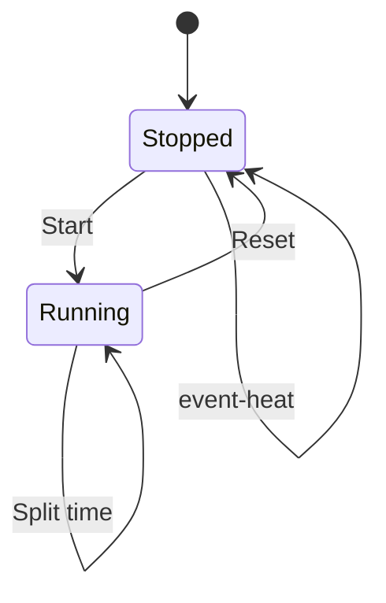

# WebSocket API Documentation

This document describes all WebSocket message types exchanged between the frontend and backend in the ws-swim-stopwatch project. It covers message structure, direction, and usage examples.

## Message Types

## Time Sync

### `ping`
- **Direction:** Client → Server
- **Description:** Sent by the client to measure latency and synchronize time.
- **Payload:**
  ```json
  { "type": "ping", "time": 1718035200000 }
  ```
  - `time`: Client timestamp (ms since epoch)

### `pong`
- **Direction:** Server → Client
- **Description:** Response to `ping`, used for time sync and round-trip time measurement.
- **Payload:**
  ```json
  { "type": "pong", "client_ping_time": 1718035200000, "server_time": 1718035200100 }
  ```
  - `client_ping_time`: Echoes the original ping time
  - `server_time`: Server timestamp (ms since epoch)

###  `time_sync`
- **Direction:** Server → Client (periodic broadcast)
- **Description:** Periodic time synchronization message.
- **Payload:**
  ```json
  { "type": "time_sync", "server_time": 1718035200000 }
  ```
  - `server_time`: Server timestamp (ms since epoch)

## Stopwatch Control

### `start`
- **Direction:** Client → Server (broadcast to all clients)
- **Description:** Starts the stopwatch for a specific event/heat.
- **Payload:**
  ```json
  { "type": "start", "event": 1, "heat": 2, "time": 1718035200000, "timestamp": 1718035200000 }
  ```
  - `event`: Event number or string
  - `heat`: Heat number or string
  - `time`: (optional) Start time
  - `timestamp`: Server-generated timestamp

### `reset` / `stop`
- **Direction:** Client → Server (broadcast to all clients)
- **Description:** Stops or resets the stopwatch.
- **Payload:**
  ```json
  { "type": "reset", "timestamp": 1718035210000 }
  ```
  - `timestamp`: Server-generated timestamp

### `split` / `lap`
- **Direction:** Client → Server (broadcast to all clients)
- **Description:** Records a split/lap for a lane.
- **Payload:**
  ```json
  { "type": "split", "lane": 3, "timestamp": 1718035205000 }
  ```
  - `lane`: Lane number
  - `timestamp`: Split time (ms since epoch)

## Event and Heat Control

### `event-heat`
- **Direction:** Client → Server (broadcast to all clients)
- **Description:** Changes the current event and heat. only when stopped.
- **Payload:**
  ```json
  { "type": "event-heat", "event": 1, "heat": 2 }
  ```
  - `event`: Event number or string
  - `heat`: Heat number or string

### `clear`
- **Direction:** Client → Server (broadcast to all clients)
- **Description:** Clears all lane and split information on all clients.
- **Payload:**
  ```json
  { "type": "clear" }
  ```


### Custom/Other
- **Direction:** Both
- **Description:** Any other message type is broadcast as-is. Structure may vary.

## WebSocket State Diagram for stopwatch

Below is a state diagram illustrating the main states and transitions for stopwatch and event/heat control via the WebSocket API. This diagram focuses on the flow of control messages between clients and the server.



- **Idle:** Waiting for a race to start. Receives event/heat changes, clear, or time sync messages.
- **Running:** Stopwatch is active. Can receive split, event/heat, or time sync messages.
- **Stopped:** Stopwatch has been stopped/reset. Can receive event/heat, clear, or time sync messages.

This diagram summarizes the control flow; actual message payloads and additional details are described above.


## Notes
- All messages are JSON objects with a `type` field.
- Unknown message types are broadcast to all clients as-is.
- Timestamps are in milliseconds since the Unix epoch (UTC).

---
For implementation details, see `/src/websockets/messageTypes.ts` and `/src/websockets/websocket.ts`.
