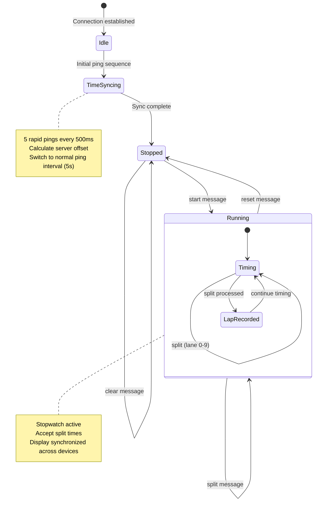
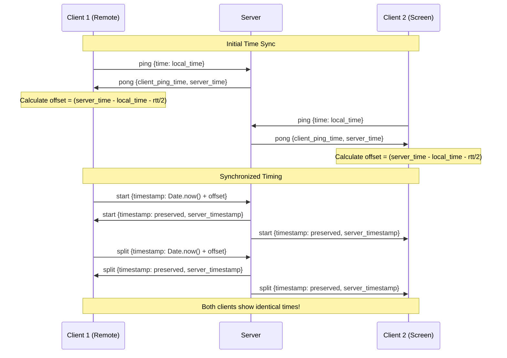

# WebSocket API Documentation

This document describes all WebSocket message types exchanged between the frontend and backend in the ws-swim-stopwatch project. It covers message structure, direction, and usage examples.

## Message Types

## Time Sync

### `ping`
- **Direction:** Client → Server
- **Description:** Sent by the client to measure latency and synchronize time.
- **Payload:**
  ```json
  { "type": "ping", "time": 1718035200000 }
  ```
  - `time`: Client timestamp (ms since epoch)

### `pong`
- **Direction:** Server → Client
- **Description:** Response to `ping`, used for time sync and round-trip time measurement.
- **Payload:**
  ```json
  { "type": "pong", "client_ping_time": 1718035200000, "server_time": 1718035200100 }
  ```
  - `client_ping_time`: Echoes the original ping time
  - `server_time`: Server timestamp (ms since epoch)

###  `time_sync`
- **Direction:** Server → Client (periodic broadcast)
- **Description:** Periodic time synchronization message.
- **Payload:**
  ```json
  { "type": "time_sync", "server_time": 1718035200000 }
  ```
  - `server_time`: Server timestamp (ms since epoch)

## Stopwatch Control

### `start`
- **Direction:** Client → Server (broadcast to all clients)
- **Description:** Starts the stopwatch for a specific event/heat.
- **Payload (Outgoing):**
  ```json
  { "type": "start", "event": 1, "heat": 2, "timestamp": 1718035200000.1234 }
  ```
- **Payload (Incoming - Server broadcast):**
  ```json
  { "type": "start", "event": 1, "heat": 2, "timestamp": 1718035200000.1234, "server_timestamp": 1718035200003 }
  ```
  - `event`: Event number or string
  - `heat`: Heat number or string
  - `timestamp`: Start time (ms since epoch, client-generated with server offset applied, preserved by server)
  - `server_timestamp`: Server's local timestamp when message was processed (added by server)

### `reset` / `stop`
- **Direction:** Client → Server (broadcast to all clients)
- **Description:** Stops or resets the stopwatch.
- **Payload (Outgoing):**
  ```json
  { "type": "reset" }
  ```
- **Payload (Incoming - Server broadcast):**
  ```json
  { "type": "reset", "timestamp": 1718035210000, "server_timestamp": 1718035210003 }
  ```
  - `timestamp`: Server-generated timestamp for reset time
  - `server_timestamp`: Server's local timestamp when message was processed

### `split` / `lap`
- **Direction:** Client → Server (broadcast to all clients)
- **Description:** Records a split/lap for a lane.
- **Payload (Outgoing):**
  ```json
  { "type": "split", "lane": 3, "timestamp": 1718035205000.5678 }
  ```
- **Payload (Incoming - Server broadcast):**
  ```json
  { "type": "split", "lane": 3, "timestamp": 1718035205000.5678, "server_timestamp": 1718035205003 }
  ```
  - `lane`: Lane number (0-9)
  - `timestamp`: Split time (ms since epoch, client-generated with server offset applied, preserved by server)
  - `server_timestamp`: Server's local timestamp when message was processed (added by server)

## Event and Heat Control

### `event-heat`
- **Direction:** Client → Server (broadcast to all clients)
- **Description:** Changes the current event and heat. only when stopped.
- **Payload:**
  ```json
  { "type": "event-heat", "event": 1, "heat": 2 }
  ```
  - `event`: Event number or string
  - `heat`: Heat number or string

### `clear`
- **Direction:** Client → Server (broadcast to all clients)
- **Description:** Clears all lane and split information on all clients.
- **Payload (Outgoing):**
  ```json
  { "type": "clear" }
  ```
- **Payload (Incoming - Server broadcast):**
  ```json
  { "type": "clear", "server_timestamp": 1718035220000 }
  ```
  - `server_timestamp`: Server's local timestamp when message was processed (added by server)

## Time Synchronization Behavior

### Client Time Synchronization
1. **Initial Sync:** Clients perform rapid ping sequence (5 pings at 500ms intervals) upon connection
2. **Ongoing Sync:** Regular pings every 5 seconds + periodic `time_sync` messages
3. **Offset Calculation:** Clients calculate `serverTimeOffset = (server_time - client_time - rtt/2)`
4. **Usage:** All outgoing timestamps use `Date.now() + serverTimeOffset` for synchronization

### Timestamp Preservation
- **Client → Server:** Clients send synchronized timestamps (local time + server offset)
- **Server Behavior:** Server preserves original client timestamps (no overwriting)
- **Server → Clients:** All clients receive identical timestamps, ensuring perfect synchronization
- **Precision:** Timestamps maintain decimal precision (sub-millisecond accuracy)

### Custom/Other
- **Direction:** Both
- **Description:** Any other message type is broadcast as-is. Structure may vary.

## WebSocket State Diagram for stopwatch

Below is a state diagram illustrating the main states and transitions for stopwatch and event/heat control via the WebSocket API.



**State Descriptions:**
- **Idle:** Initial connection state, waiting for time sync
- **TimeSyncing:** Performing initial rapid ping sequence for time synchronization
- **Stopped:** Stopwatch inactive, can change event/heat, clear data, or start timing
- **Running:** Stopwatch active, recording split times with synchronized timestamps
- **Timing:** Within running state, actively timing the race
- **LapRecorded:** Momentary state when a split is recorded and broadcast

This diagram summarizes the control flow; actual message payloads and additional details are described above.


## Notes
- All messages are JSON objects with a `type` field.
- Unknown message types are broadcast to all clients as-is.
- Timestamps are in milliseconds since the Unix epoch (UTC) with decimal precision.
- **Server adds `server_timestamp`** to all broadcast messages for debugging/logging purposes.
- **Client timestamps are preserved** by the server to maintain synchronization across devices.
- **Time synchronization ensures** all devices show identical split times regardless of network latency.

## Time Synchronization Architecture



---
For implementation details, see `/src/websockets/messageTypes.ts` and `/src/websockets/websocket.ts`.
